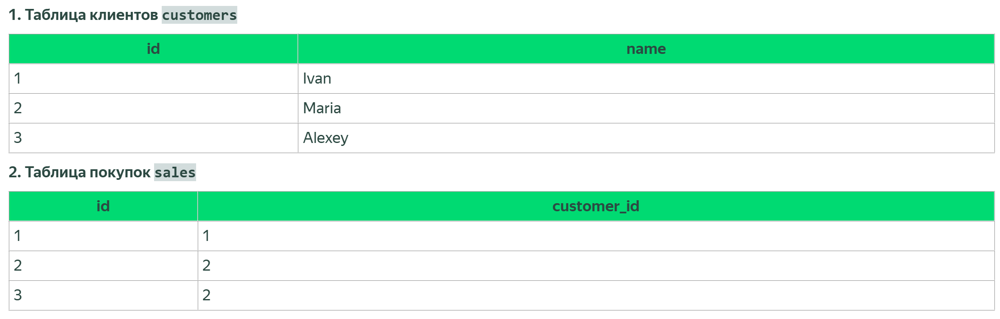

# JOIN - запросы



> Пример двух таблиц

## JOIN ON

```
SELECT 
    s.sale_id,
    s.sale_datetime,
    c.customer_name
FROM sales s
JOIN customers c ON s.customer_id = c.customer_id
ORDER BY s.sale_datetime DESC;
```

## INNER JOIN

```
SELECT customers.name,
       sales.id AS sale_id
FROM customers
         INNER JOIN sales
                    ON customers.id = sales.customer_id;    
```

возвращает только те строки, для которых есть связь в обеих таблицах

### Результат

| name |	sale_id |
|---|------|
| Ivan |	1 |
| Maria |	2 |
| Maria |	3 |


## LEFT JOIN

```
SELECT customers.name,
       sales.id AS sale_id
FROM customers
         LEFT JOIN sales
                   ON customers.id = sales.customer_id;
```

сохраняет все строки из левой таблицы, даже если связи нет

### Результат 

| name   | 	sale_id |
|--------|----------|
| Ivan   | 	1       |
| Maria  | 	2       |
| Maria  | 	3       |
| Alexey | 	NULL    |


## RIGHT JOIN

```
SELECT customers.name,
       sales.id AS sale_id
FROM customers
         RIGHT JOIN sales
                    ON customers.id = sales.customer_id;
```

сохраняет все строки из правой таблицы

### Результат

| name   | 	sale_id |
|--------|----------|
| Ivan   | 	1       |
| Maria  | 	2       |
| Maria  | 	3       |


## FULL JOIN

```
SELECT customers.name,
       sales.id AS sale_id
FROM customers
         FULL JOIN sales
                   ON customers.id = sales.customer_id;
```

возвращает все строки из обеих таблиц: совпадающие объединяются, а не связанные остаются с NULL

### Результат

| name   | 	sale_id |
|--------|----------|
| Ivan   | 	1       |
| Maria  | 	2       |
| Maria  | 	3       |
| Alexey | 	NULL    |


## CROSS JOIN

```
SELECT customers.name,
       sales.id AS sale_id
FROM customers
         CROSS JOIN sales;
```

соединяет каждую строку первой таблицы с каждой строкой второй, без условия

| name   | 	sale_id |
|--------|----------|
| Ivan   | 	1       |
| Ivan   | 	2       |
| Ivan   | 	3       |
| Maria  | 	1       |
| Maria  | 	2       |
| Maria  | 	3       |
| Alexey | 	1       |
| Alexey | 	2       |
| Alexey | 	3       |


## SELF JOIN

```
SELECT c1.name AS client,
       c2.name AS referrer
FROM customers c1
         LEFT JOIN customers c2
                   ON c1.referrer_id = c2.id;
```

### Результат

| client   | 	referrer |
|--------|----------|
| Ivan   | 	NULL    |
| Maria  | 	Ivan    |
| Alexey | 	Ivan    |
